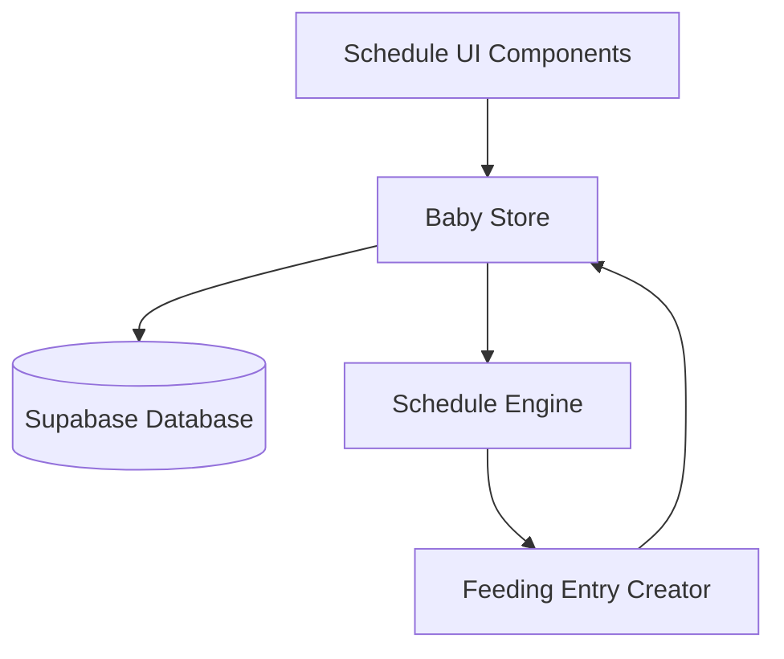
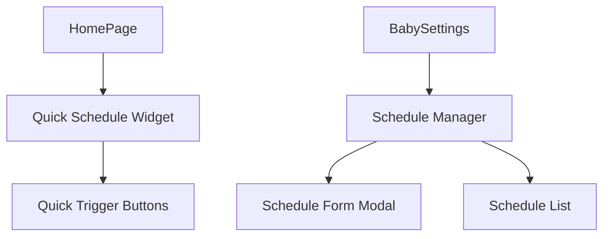

# Design Document

## Overview

The Automated Feeding Schedule feature provides a simple, action-triggered system for creating feeding entries based on predefined templates. Users can create schedule templates that specify feeding type (breast, formula, solids) and trigger the creation of feeding entries with a single button press or action.

## Architecture

### High-Level Architecture



### Component Architecture



## Components and Interfaces

### Core Components

#### 1. ScheduleManager.vue

- **Purpose**: Main interface for managing feeding schedules
- **Features**:
  - List all schedules for a baby
  - Create/edit/delete schedules
  - Enable/disable schedules
  - View schedule statistics

#### 2. ScheduleForm.vue

- **Purpose**: Modal form for creating/editing schedules
- **Features**:
  - Schedule name input
  - Feeding type selection (breast, formula, solids)
  - Default amount for formula
  - Enable/disable toggle

#### 3. QuickScheduleWidget.vue

- **Purpose**: Compact widget for homepage with quick trigger buttons
- **Features**:
  - Show active schedules as buttons
  - One-click feeding entry creation
  - Visual feedback on success

#### 4. ScheduleTriggerButton.vue

- **Purpose**: Reusable button component for triggering schedules
- **Features**:
  - Display schedule name and type
  - Loading state during creation
  - Success/error feedback

### Data Models

#### FeedingSchedule Interface

```typescript
interface FeedingSchedule {
  id: string;
  baby_id: string;
  user_id: string;
  name: string;
  feeding_type: "breast" | "formula" | "solid";
  default_amount?: number; // For formula only
  is_active: boolean;
  created_at: string;
  updated_at: string;
  last_used_at?: string;
  usage_count: number;
}
```

#### ScheduleUsageStats Interface

```typescript
interface ScheduleUsageStats {
  schedule_id: string;
  total_uses: number;
  last_used: string | null;
  success_rate: number;
  avg_time_between_uses: number; // in minutes
}
```

## Data Models

### Database Schema

#### feeding_schedules Table

```sql
CREATE TABLE feeding_schedules (
  id UUID DEFAULT gen_random_uuid() PRIMARY KEY,
  baby_id UUID NOT NULL REFERENCES babies(id) ON DELETE CASCADE,
  user_id UUID NOT NULL REFERENCES auth.users(id) ON DELETE CASCADE,
  name TEXT NOT NULL CHECK (length(trim(name)) > 0 AND length(trim(name)) <= 50),
  feeding_type TEXT NOT NULL CHECK (feeding_type IN ('breast', 'formula', 'solid')),
  default_amount INTEGER CHECK (default_amount > 0 AND default_amount <= 500),
  is_active BOOLEAN DEFAULT true,
  created_at TIMESTAMP WITH TIME ZONE DEFAULT NOW(),
  updated_at TIMESTAMP WITH TIME ZONE DEFAULT NOW(),
  last_used_at TIMESTAMP WITH TIME ZONE,
  usage_count INTEGER DEFAULT 0 CHECK (usage_count >= 0)
);
```

#### Indexes and Constraints

```sql
CREATE INDEX idx_feeding_schedules_baby_id ON feeding_schedules(baby_id);
CREATE INDEX idx_feeding_schedules_user_id ON feeding_schedules(user_id);
CREATE INDEX idx_feeding_schedules_active ON feeding_schedules(baby_id, is_active);
```

### Store Integration

#### New Store Functions

```typescript
// Schedule Management
addFeedingSchedule(scheduleData: CreateFeedingScheduleData): Promise<FeedingSchedule>
updateFeedingSchedule(scheduleId: string, updates: UpdateFeedingScheduleData): Promise<FeedingSchedule>
deleteFeedingSchedule(scheduleId: string): Promise<void>
getBabyFeedingSchedules(babyId: string): FeedingSchedule[]
getActiveFeedingSchedules(babyId: string): FeedingSchedule[]

// Schedule Execution
triggerFeedingSchedule(scheduleId: string): Promise<Feeding>
updateScheduleUsage(scheduleId: string): Promise<void>
```

## Error Handling

### Validation Rules

1. **Schedule Name**: Required, 1-50 characters, unique per baby
2. **Feeding Type**: Must be 'breast', 'formula', or 'solid'
3. **Default Amount**: Optional for formula, 1-500ml if provided
4. **Active Schedules**: Maximum 10 active schedules per baby

### Error Scenarios

1. **Schedule Creation Fails**: Show error message, keep form open
2. **Trigger Fails**: Show error notification, don't update usage stats
3. **Network Issues**: Queue actions for retry when connection restored
4. **Validation Errors**: Highlight invalid fields with specific messages

### Error Messages

```typescript
const ERROR_MESSAGES = {
  SCHEDULE_NAME_REQUIRED: "Schedule name is required",
  SCHEDULE_NAME_TOO_LONG: "Schedule name must be 50 characters or less",
  SCHEDULE_NAME_EXISTS: "A schedule with this name already exists",
  INVALID_FEEDING_TYPE: "Please select a valid feeding type",
  INVALID_AMOUNT: "Amount must be between 1 and 500ml",
  MAX_SCHEDULES_REACHED: "Maximum of 10 active schedules allowed per baby",
  TRIGGER_FAILED: "Failed to create feeding entry. Please try again.",
  NETWORK_ERROR:
    "Network error. Changes will be saved when connection is restored.",
};
```

## Testing Strategy

### Unit Tests

1. **Schedule Validation**: Test all validation rules and edge cases
2. **Store Functions**: Test CRUD operations and error handling
3. **Schedule Triggering**: Test feeding entry creation logic
4. **Usage Statistics**: Test usage tracking and calculations

### Integration Tests

1. **Schedule Workflow**: Create schedule → trigger → verify feeding entry
2. **Multi-Baby Support**: Test schedule isolation between babies
3. **Error Recovery**: Test error handling and retry mechanisms
4. **Data Consistency**: Test concurrent schedule operations

### Component Tests

1. **ScheduleForm**: Test form validation and submission
2. **QuickScheduleWidget**: Test button rendering and click handling
3. **ScheduleManager**: Test list operations and state management
4. **TriggerButton**: Test loading states and feedback

### User Acceptance Tests

1. **Schedule Creation**: User can create and configure schedules
2. **Quick Triggering**: User can create feeding entries with one click
3. **Schedule Management**: User can edit, disable, and delete schedules
4. **Visual Feedback**: User receives clear feedback on all actions

## Implementation Notes

### Minimal Viable Product (MVP) Scope

1. **Core Features**:

   - Create/edit/delete schedules
   - Trigger feeding entry creation
   - Basic schedule management UI
   - Integration with existing feeding system

2. **Excluded from MVP**:
   - Time-based automatic triggering
   - Advanced scheduling rules
   - Schedule templates/presets
   - Detailed analytics dashboard

### Performance Considerations

1. **Database Queries**: Use indexes for efficient schedule lookups
2. **UI Responsiveness**: Optimistic updates for trigger actions
3. **Memory Usage**: Lazy load schedule statistics
4. **Network Efficiency**: Batch schedule operations when possible

### Security Considerations

1. **Row Level Security**: Ensure users can only access their own schedules
2. **Input Validation**: Sanitize all user inputs on client and server
3. **Rate Limiting**: Prevent abuse of schedule triggering
4. **Data Privacy**: No sensitive information in schedule names

### Accessibility

1. **Keyboard Navigation**: All schedule actions accessible via keyboard
2. **Screen Readers**: Proper ARIA labels and descriptions
3. **Visual Indicators**: Clear visual feedback for all states
4. **Color Contrast**: Ensure sufficient contrast for all UI elements
