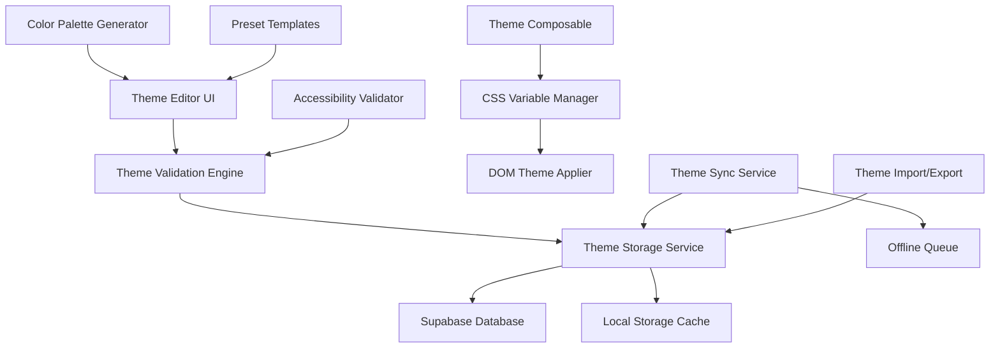

# Custom Themes - Design Document

## Overview

The custom themes feature extends the existing theme system to allow users to create, customize, and manage personalized themes. The design builds upon the current CSS custom properties architecture and Vue composable pattern, adding a theme editor interface, cloud synchronization, and accessibility validation.

## Architecture

### System Components



### Data Flow

1. **Theme Creation**: User creates theme → Validation → Storage → Application
2. **Theme Switching**: User selects theme → Load from cache/DB → Apply CSS variables → Update UI
3. **Theme Sync**: Local changes → Queue for sync → Upload to Supabase → Update other devices
4. **Theme Import**: Import data → Validation → Preview → User confirmation → Storage

## Components and Interfaces

### Core Data Models

```typescript
// Theme data structure
interface CustomTheme {
  id: string;
  name: string;
  user_id: string;
  is_default: boolean;
  created_at: string;
  updated_at: string;
  theme_data: ThemeData;
  accessibility_score: number;
  tags: string[];
}

interface ThemeData {
  // Primary colors
  primary: string;
  primaryDark: string;
  primaryLight: string;

  // Background colors
  bgPrimary: string;
  bgSecondary: string;
  bgTertiary: string;

  // Text colors
  textPrimary: string;
  textSecondary: string;
  textAccent: string;

  // Surface colors
  surface: string;
  surfaceHover: string;
  surfaceBorder: string;

  // Semantic colors (optional overrides)
  success?: string;
  error?: string;
  warning?: string;
  info?: string;

  // Generated variations (computed)
  variations?: ThemeVariations;
}

interface ThemeVariations {
  primaryHover: string;
  primaryActive: string;
  primaryDisabled: string;
  // ... other computed variations
}

// Theme validation result
interface ThemeValidationResult {
  isValid: boolean;
  accessibilityScore: number;
  errors: ValidationError[];
  warnings: ValidationWarning[];
  suggestions: string[];
}

// Theme preset template
interface ThemeTemplate {
  id: string;
  name: string;
  description: string;
  category: "warm" | "cool" | "nature" | "ocean" | "monochrome" | "vibrant";
  preview_colors: string[];
  theme_data: Partial<ThemeData>;
}
```

### Database Schema

```sql
-- Custom themes table
CREATE TABLE custom_themes (
  id UUID PRIMARY KEY DEFAULT gen_random_uuid(),
  user_id UUID NOT NULL REFERENCES auth.users(id) ON DELETE CASCADE,
  name VARCHAR(100) NOT NULL,
  is_default BOOLEAN DEFAULT FALSE,
  theme_data JSONB NOT NULL,
  accessibility_score DECIMAL(3,2) DEFAULT 0,
  tags TEXT[] DEFAULT '{}',
  created_at TIMESTAMP WITH TIME ZONE DEFAULT NOW(),
  updated_at TIMESTAMP WITH TIME ZONE DEFAULT NOW(),

  CONSTRAINT unique_user_theme_name UNIQUE(user_id, name),
  CONSTRAINT valid_accessibility_score CHECK (accessibility_score >= 0 AND accessibility_score <= 100)
);

-- Theme sharing table (for import/export)
CREATE TABLE shared_themes (
  id UUID PRIMARY KEY DEFAULT gen_random_uuid(),
  theme_id UUID NOT NULL REFERENCES custom_themes(id) ON DELETE CASCADE,
  share_code VARCHAR(20) UNIQUE NOT NULL,
  created_by UUID NOT NULL REFERENCES auth.users(id),
  download_count INTEGER DEFAULT 0,
  expires_at TIMESTAMP WITH TIME ZONE,
  created_at TIMESTAMP WITH TIME ZONE DEFAULT NOW()
);

-- Indexes
CREATE INDEX idx_custom_themes_user_id ON custom_themes(user_id);
CREATE INDEX idx_custom_themes_updated_at ON custom_themes(updated_at);
CREATE INDEX idx_shared_themes_share_code ON shared_themes(share_code);
```

### Vue Composables

#### Enhanced Theme Composable

```typescript
// Extended useTheme composable
export const useTheme = () => {
  // ... existing theme functionality

  // Custom theme management
  const customThemes = ref<CustomTheme[]>([]);
  const activeCustomTheme = ref<CustomTheme | null>(null);

  const loadCustomThemes = async () => {
    // Load user's custom themes from Supabase
  };

  const createCustomTheme = async (themeData: ThemeData, name: string) => {
    // Validate and create new custom theme
  };

  const applyCustomTheme = (theme: CustomTheme) => {
    // Apply custom theme CSS variables
  };

  const deleteCustomTheme = async (themeId: string) => {
    // Delete custom theme with confirmation
  };

  return {
    // ... existing returns
    customThemes,
    activeCustomTheme,
    loadCustomThemes,
    createCustomTheme,
    applyCustomTheme,
    deleteCustomTheme,
  };
};
```

#### Theme Validation Composable

```typescript
export const useThemeValidation = () => {
  const validateTheme = (themeData: ThemeData): ThemeValidationResult => {
    // WCAG contrast ratio validation
    // Color accessibility checks
    // Theme completeness validation
  };

  const generateColorVariations = (
    baseColors: Partial<ThemeData>
  ): ThemeVariations => {
    // Generate hover, active, disabled states
    // Ensure proper contrast ratios
  };

  const suggestColorPalette = (primaryColor: string): string[] => {
    // Generate complementary colors
    // Return accessibility-compliant suggestions
  };

  return {
    validateTheme,
    generateColorVariations,
    suggestColorPalette,
  };
};
```

### UI Components

#### Theme Editor Modal

```vue
<template>
  <ResponsiveModal v-model="isOpen" title="Create Custom Theme" size="lg">
    <div class="theme-editor">
      <!-- Theme Name Input -->
      <FormInput v-model="themeName" label="Theme Name" required />

      <!-- Template Selection -->
      <ThemeTemplateSelector v-model="selectedTemplate" />

      <!-- Color Customization -->
      <div class="color-sections">
        <ColorSection
          title="Primary Colors"
          :colors="primaryColors"
          @update="updatePrimaryColors"
        />
        <ColorSection
          title="Background Colors"
          :colors="backgroundColors"
          @update="updateBackgroundColors"
        />
        <ColorSection
          title="Text Colors"
          :colors="textColors"
          @update="updateTextColors"
        />
      </div>

      <!-- Live Preview -->
      <ThemePreview :theme-data="currentThemeData" />

      <!-- Accessibility Score -->
      <AccessibilityScore :score="accessibilityScore" :warnings="warnings" />

      <!-- Actions -->
      <div class="theme-editor__actions">
        <button @click="saveTheme" :disabled="!isValid">Save Theme</button>
        <button @click="previewTheme">Preview</button>
        <button @click="resetToTemplate">Reset</button>
      </div>
    </div>
  </ResponsiveModal>
</template>
```

#### Theme Manager Component

```vue
<template>
  <div class="theme-manager">
    <div class="theme-manager__header">
      <h2>My Themes</h2>
      <button @click="openThemeEditor">Create New Theme</button>
    </div>

    <div class="theme-grid">
      <ThemeCard
        v-for="theme in customThemes"
        :key="theme.id"
        :theme="theme"
        :is-active="activeTheme?.id === theme.id"
        @select="applyTheme"
        @edit="editTheme"
        @duplicate="duplicateTheme"
        @delete="deleteTheme"
        @share="shareTheme"
      />
    </div>

    <div class="theme-import">
      <h3>Import Theme</h3>
      <input type="text" v-model="importCode" placeholder="Enter theme code" />
      <button @click="importTheme">Import</button>
    </div>
  </div>
</template>
```

## Data Models

### Theme Storage Strategy

1. **Primary Storage**: Supabase database for persistence and sync
2. **Local Cache**: Browser localStorage for offline access and performance
3. **Sync Queue**: Local queue for offline changes, synced when online

### Color Processing Pipeline

1. **Input Validation**: Ensure valid color formats (hex, rgb, hsl)
2. **Accessibility Check**: WCAG contrast ratio validation
3. **Variation Generation**: Create hover, active, disabled states
4. **CSS Variable Mapping**: Map to existing design system variables
5. **Performance Optimization**: Minimize CSS custom property updates

## Error Handling

### Validation Errors

```typescript
enum ThemeValidationError {
  INVALID_COLOR_FORMAT = "INVALID_COLOR_FORMAT",
  INSUFFICIENT_CONTRAST = "INSUFFICIENT_CONTRAST",
  MISSING_REQUIRED_COLOR = "MISSING_REQUIRED_COLOR",
  DUPLICATE_THEME_NAME = "DUPLICATE_THEME_NAME",
}

interface ValidationError {
  type: ThemeValidationError;
  field: string;
  message: string;
  suggestion?: string;
}
```

### Sync Error Handling

- **Network Errors**: Queue changes locally, retry with exponential backoff
- **Conflict Resolution**: Last-write-wins with user notification
- **Storage Limits**: Implement theme count limits with upgrade prompts

## Testing Strategy

### Unit Tests

- Color validation functions
- Theme data transformation
- CSS variable generation
- Accessibility scoring algorithms

### Integration Tests

- Theme creation and application flow
- Sync between devices
- Import/export functionality
- Offline/online state transitions

### Accessibility Tests

- Contrast ratio validation
- Screen reader compatibility
- High contrast mode integration
- Color blindness simulation

### Performance Tests

- Theme switching speed
- CSS variable update performance
- Large theme collection handling
- Memory usage optimization

## Security Considerations

### Data Validation

- Sanitize all user input colors
- Validate theme data structure
- Prevent CSS injection attacks
- Limit theme data size

### Access Control

- User can only access their own themes
- Shared themes are read-only
- Rate limiting on theme operations
- Secure share code generation

### Privacy

- No tracking of theme usage patterns
- Optional theme sharing with explicit consent
- Local storage encryption for sensitive themes
- GDPR compliance for theme data export

## Performance Optimizations

### CSS Variable Management

- Batch CSS custom property updates
- Use CSS containment for theme transitions
- Minimize reflow/repaint during theme changes
- Lazy load theme variations

### Caching Strategy

- Cache frequently used themes in memory
- Preload active theme variations
- Background sync for theme updates
- Efficient diff algorithms for theme changes

### Bundle Size Optimization

- Tree-shake unused color utilities
- Compress theme data in storage
- Lazy load theme editor components
- Optimize color picker libraries
