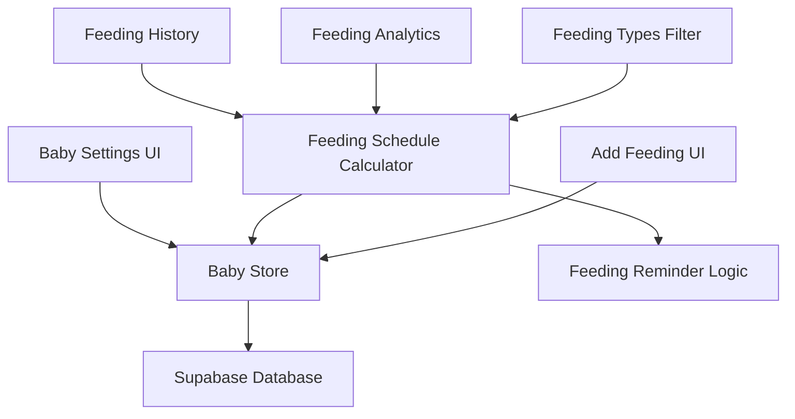

# Feeding Schedule Configuration - Design Document

## Overview

This feature extends the existing baby_settings table to include a configuration option for whether solid foods should be included in feeding schedule calculations. The design maintains backward compatibility while providing granular control over feeding schedule logic per baby.

## Architecture

### System Components



### Data Flow

1. **Settings Update**: User changes setting → Update baby_settings → Recalculate next feeding time
2. **Feeding Addition**: Add feeding → Check if type should count → Update schedule if applicable
3. **Schedule Calculation**: Get feedings → Filter by schedule setting → Calculate intervals

## Components and Interfaces

### Database Schema Changes

```sql
-- Add new column to existing baby_settings table
ALTER TABLE baby_settings
ADD COLUMN include_solids_in_schedule BOOLEAN DEFAULT FALSE;

-- Update existing records to have the default value
UPDATE baby_settings
SET include_solids_in_schedule = FALSE
WHERE include_solids_in_schedule IS NULL;
```

### Updated TypeScript Interfaces

```typescript
// Update existing baby_settings interface
interface BabySettings {
  id: string;
  baby_id: string;
  feeding_interval_hours: number;
  default_breast_amount: number;
  default_formula_amount: number;
  include_solids_in_schedule: boolean; // New field
  created_at: string;
  updated_at: string;
}

// Feeding schedule calculation options
interface FeedingScheduleOptions {
  baby_id: string;
  include_solids: boolean;
  interval_hours: number;
}

// Feeding filter types
type ScheduleRelevantFeedingType = "breast" | "formula" | "nursing";
type AllFeedingType = ScheduleRelevantFeedingType | "solid";
```

### Core Logic Functions

```typescript
// Feeding schedule calculation utilities
export const getFeedingTypesForSchedule = (
  includesolids: boolean
): AllFeedingType[] => {
  const baseFeedingTypes: ScheduleRelevantFeedingType[] = [
    "breast",
    "formula",
    "nursing",
  ];
  return includesolids ? [...baseFeedingTypes, "solid"] : baseFeedingTypes;
};

export const getScheduleRelevantFeedings = (
  feedings: Feeding[],
  includesolids: boolean
): Feeding[] => {
  const relevantTypes = getFeedingTypesForSchedule(includesolids);
  return feedings.filter((feeding) => relevantTypes.includes(feeding.type));
};

export const calculateNextFeedingTime = (
  lastFeedings: Feeding[],
  intervalHours: number,
  includesolids: boolean
): Date | null => {
  const relevantFeedings = getScheduleRelevantFeedings(
    lastFeedings,
    includesolids
  );

  if (relevantFeedings.length === 0) return null;

  // Get the most recent schedule-relevant feeding
  const lastRelevantFeeding = relevantFeedings[0]; // Assuming sorted by timestamp desc
  const lastFeedingTime = new Date(lastRelevantFeeding.timestamp);

  // Add interval hours
  return new Date(lastFeedingTime.getTime() + intervalHours * 60 * 60 * 1000);
};
```

### Store Updates

```typescript
// Add to baby store
export const useBabyStore = defineStore("baby", () => {
  // ... existing code

  // Get baby settings with defaults
  const getBabySettings = (babyId: string): BabySettings | null => {
    return babySettings.value.find((s) => s.baby_id === babyId) || null;
  };

  // Update baby settings
  const updateBabySettings = async (
    babyId: string,
    updates: Partial<BabySettings>
  ) => {
    if (!currentUser.value) throw new Error("User not authenticated");

    const { data, error } = await supabase
      .from("baby_settings")
      .update({
        ...updates,
        updated_at: new Date().toISOString(),
      })
      .eq("baby_id", babyId)
      .select()
      .single();

    if (error) throw error;

    // Update local state
    const index = babySettings.value.findIndex((s) => s.baby_id === babyId);
    if (index !== -1) {
      babySettings.value[index] = data;
    }

    return data;
  };

  // Get next feeding time for a baby
  const getNextFeedingTime = (babyId: string): Date | null => {
    const settings = getBabySettings(babyId);
    if (!settings) return null;

    const babyFeedings = feedings.value.filter((f) => f.baby_id === babyId);

    return calculateNextFeedingTime(
      babyFeedings,
      settings.feeding_interval_hours,
      settings.include_solids_in_schedule
    );
  };

  // Check if feeding type affects schedule for a baby
  const doesFeedingAffectSchedule = (
    babyId: string,
    feedingType: AllFeedingType
  ): boolean => {
    const settings = getBabySettings(babyId);
    if (!settings) return feedingType !== "solid"; // Default behavior

    const relevantTypes = getFeedingTypesForSchedule(
      settings.include_solids_in_schedule
    );
    return relevantTypes.includes(feedingType);
  };

  return {
    // ... existing returns
    getBabySettings,
    updateBabySettings,
    getNextFeedingTime,
    doesFeedingAffectSchedule,
  };
});
```

### UI Components

#### Baby Settings Form Extension

```vue
<template>
  <div class="baby-settings-form">
    <!-- Existing settings fields -->

    <div class="form-group">
      <label class="form-label">
        <input
          type="checkbox"
          v-model="localSettings.include_solids_in_schedule"
          @change="handleSolidsScheduleChange"
        />
        Include solid foods in feeding schedule
      </label>
      <p class="form-help-text">
        When enabled, solid food feedings will count towards feeding intervals
        and reminders. When disabled (default), only milk feedings (breast,
        formula, nursing) affect the schedule.
      </p>
    </div>
  </div>
</template>

<script setup lang="ts">
import { ref, watch } from "vue";
import { useBabyStore } from "../stores/babyStore";

interface Props {
  babyId: string;
}

const props = defineProps<Props>();
const { getBabySettings, updateBabySettings } = useBabyStore();

const localSettings = ref({
  include_solids_in_schedule: false,
  // ... other settings
});

// Load current settings
const loadSettings = () => {
  const settings = getBabySettings(props.babyId);
  if (settings) {
    localSettings.value.include_solids_in_schedule =
      settings.include_solids_in_schedule;
    // ... load other settings
  }
};

// Handle solids schedule change
const handleSolidsScheduleChange = async () => {
  try {
    await updateBabySettings(props.babyId, {
      include_solids_in_schedule:
        localSettings.value.include_solids_in_schedule,
    });

    // Show success message
    console.log("Feeding schedule setting updated");
  } catch (error) {
    console.error("Failed to update setting:", error);
    // Revert the change
    loadSettings();
  }
};

// Load settings on mount
onMounted(loadSettings);
</script>
```

## Data Models

### Migration Strategy

1. **Database Migration**: Add the new column with a default value of `FALSE`
2. **Backward Compatibility**: Existing logic continues to work as before
3. **Gradual Rollout**: New setting only affects babies where it's explicitly changed

### Default Behavior

- **New Babies**: `include_solids_in_schedule = FALSE` (solid foods excluded)
- **Existing Babies**: `include_solids_in_schedule = FALSE` (maintains current behavior)
- **User Choice**: Can be changed per baby in settings

## Error Handling

### Database Errors

```typescript
enum FeedingScheduleError {
  SETTINGS_NOT_FOUND = "SETTINGS_NOT_FOUND",
  UPDATE_FAILED = "UPDATE_FAILED",
  INVALID_BABY_ID = "INVALID_BABY_ID",
}

const handleSettingsError = (error: any, babyId: string) => {
  if (error.code === "PGRST116") {
    // No settings found, create default
    return createDefaultBabySettings(babyId);
  }

  throw new Error(
    `Failed to update feeding schedule settings: ${error.message}`
  );
};
```

### UI Error Handling

- **Network Errors**: Show retry option, revert UI state
- **Validation Errors**: Prevent invalid settings, show helpful messages
- **Missing Settings**: Create default settings automatically

## Testing Strategy

### Unit Tests

- Feeding type filtering logic
- Schedule calculation with/without solids
- Settings update functionality
- Default value handling

### Integration Tests

- Settings form updates database correctly
- Schedule calculations update when settings change
- Feeding additions respect schedule settings
- Migration applies correctly to existing data

## Performance Considerations

### Caching Strategy

- Cache baby settings in store for quick access
- Invalidate cache when settings are updated
- Batch settings updates if multiple changes

### Query Optimization

- Index on `baby_id` for settings lookups
- Filter feedings at database level when possible
- Minimize recalculations of feeding schedules

## Security Considerations

### Data Validation

- Validate baby ownership before settings updates
- Sanitize boolean input values
- Prevent unauthorized settings access

### Access Control

- Users can only modify settings for their own babies
- Settings changes are logged with timestamps
- Audit trail for schedule configuration changes
